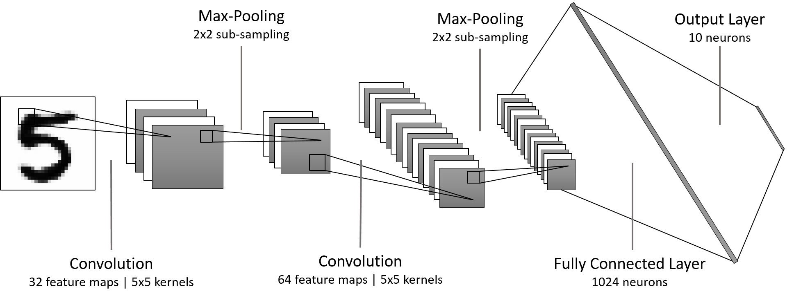
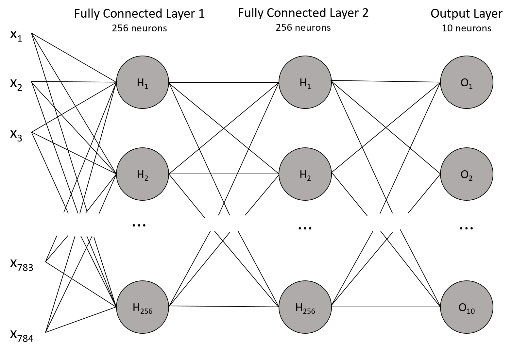
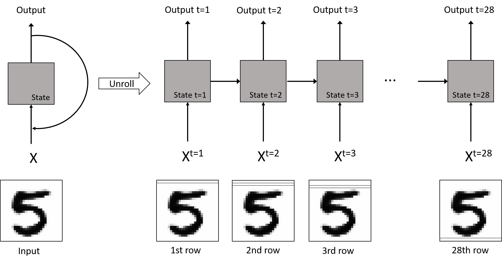

# Lynceus: Cost-efficient Tuning and Provisioning of Data Analytic Jobs

This repository contains the code and datasets used in the paper "Lynceus: Cost-efficient Tuning and Provisioning of Data Analytic Jobs", to appear in the proceedings of the 40th IEEE International Conference on Distributed Computing Systems (ICDCS 2020).


Please cite:

```
@inproceedings{Casimiro2020,
  author    = {{Casimiro}, Maria and {Didona}, Diego and {Romano}, Paolo and
         		{Rodrigues}, Lu{\'\i}s and {Zwanepoel}, Willy and {Garlan}, David},
  title	    = {Lynceus: Long-Sighted, Budget-Aware, Online Tuning of Cloud Applications},
  booktitle = {Proceedings of the 40th IEEE International Conference on Distributed Computing Systems (ICDCS) 2020}
  year	    = 2020,
  month	    = 12,
}
```


## Table of Content
1. [Introduction](#intro)  
	1.1. [Configurations in Lynceus](#config)
2. [How to Run Lynceus](#run)  
	2.1. [Input Parameters](#cmd)  
	2.2. [Running Examples](#examples)
3. [Datasets](#datasets)  
	3.1. [CNN Dataset](#cnn)  
	3.2. [MULTILAYER Dataset](#mlp)  
	3.3. [RNN Dataset](#lstm)
4. [Data Records](#dataRecords)

<a name="intro"></a>
## 1. Introduction

In recent years we have witnessed a trend for the cloud providers to increase the diversity of the platforms they offer, namely with respect to computational power, memory, storage capacity and network bandwidth. If it's true that this diversity allows users to choose amongst a broader set of resources, it is also true that such diversity renders the process of selecting the right configuration much more complex. This happens because configurations with similar performance may possess very different costs. Moreover, it is not always easy to anticipate which is the cheaper configuration that complies with the application requirements. Thus, the study of techniques for automating the process of selecting the best configuration to execute cloud applications has gained relevance.

Recent approaches to identify the optimal configuration to execute cloud applications are based on an exploration phase, during which the application is executed in a set of configurations. These systems have been shown to identify near-optimal configurations. However, the cost of the exploration phase, which can be rather high, is not taken into account.

Our research project aims at developing an approach which allows to reduce the cost of the exploration phase through a judicious choice of the configurations to explore. During our investigation, however, finding datasets that suited our needs so that we could test our approach was an arduous task. As such, we took the initiative of building datasets whose configurations encompassed both virtual machines' parameters and application specific parameters. 

We make our datasets available in this repository to help fellow researches who find themselves in the same situation as we did and to contribute to the advance of cloud computing optimization. Additionally, we also make available the code of Lynceus, our approach.

<a name="config"></a>
### 1.1 What is a Configuration in Lynceus

In Lynceus, a configuration is composed of both application specific parameters and cloud specific parameters. The table below shows the parameters we considered in our datasets and the values we tested. We had a search space composed of 384 configurations, which corresponds to the cartesian product of the dimensions of the several parameters.

<table align="center">
  <tr>
    <th colspan="2">Virtual Machine's Parameters</th>
    <th colspan="3">Neural Network's Parameters</th>
  </tr>
  <tr>
    <td align="center">VM Flavor</td>
    <td align="center">Number of Cores</td>
    <td align="center">Learning Rate</td>
    <td align="center">Batch Size</td>
    <td align="center">Synchronism</td>
  </tr>
  <tr>
    <td align="center">
    	small, medium, <br> xlarge and 2xlarge <br> of the AWS t2 family
    </td>
    <td align="center">[8, 16, 32, 48, <br> 64, 80, 96, 112]</td>
    <td align="center">1e-3 <br> 1e-4 <br> 1e-5</td>
    <td align="center">16 <br> 256</td>
    <td align="center">synchronous<br>asynchronous<br></td>
  </tr>
</table>


<a name="run"></a>
## 2. How to Run Lynceus

Lynceus was written in Java and uses the Weka software to create its performance model. Lynceus relies on several external libraries which are specified in the `pom.xml` file. Additionally, the code was written to run with Java 7. The wall-clock time to run each optimizer depends on several factors, namely the lookahead horizon, the number of seeds and the budget. More specifically, the wall-clock time increases as these parameters are set to higher values. Our longest run was deployed setting the lookahead horizon to 3, the number of seeds to 100 and the budget to 1000000. We ran this experiment on a machine with an Intel Xeon Gold 6138 CPU with 20 physical cores and 64 GB of main memory and it took a bit more than half a day. 

To run Lynceus, after cloning the repository you have two options.

**1)** Use an IDE and add the dependencies.

**2)** Change to the repo directory and do `mvn package`. This will compile the code. Then, execute the following commands:

```
JVM_OPTS="-server -Xmx14G -Xms14G -XX:+UseParNewGC -XX:+UseConcMarkSweepGC"
<path/to/java7> ${JVM_OPTS} -cp target/Lynceus-1.0-SNAPSHOT.jar:target/deps/* lynceus.Main ${1} > ${2}.out
```
where `${1}` is a list with Lynceus' input parameters and `${2}` is an output log file that stores the entire execution of the experiment.

<a name="cmd"></a>
### 2.1. Input Parameters 

Lynceus has the following input parameters:

```
optimizer:		which optimizer will be deployed. The options are: Lynceus and Rand
timeout:		whether early timeout is used. The options are: FALSE (early timeout is disabled), IDEAL, LIN (for the linear timeout), MAX_COST_PENALTY, TRUNCATED_GAUSSIAN and NO_INFO
budget:			the monetary amount available for the optimization. There is the option to select 'all', which will run the selected optimizer for the budgets = {1, 1.25, 1.5, 1.75, 2, 3, 4, 5}. Otherwise, it is possible to simply specify a given budget and only that one will be used 
workload:		which set of datasets will be used. The options are either cherrypick, scout or tensorflow.
wkld_param (dataset): 	to select a specific dataset among the set that was previously selected.
threads:		the number of threads that will be used for the parallel computation of the lookahead search of Lynceus. By setting this parameter to 0, the number of threads will be set to 1.5 * nr_processors
horizon:		corresponds to the lookahead horizon that Lynceus will use. Setting this to 0 will make Lynceus fall-back to typical BO
numInitSamples:		corresponds to the percentage of the search space that will be used to bootstrap the performance model
gamma:			lookahead parameter of Lynceus. We set it to 0.9 in our experiments. We also teste 0.5 and 0.8 but obtained worse results.
max_time_perc:		percentage of the dataset that will be considered to comply with the user constraints. We set this to 50%. 
gh:			number of weights for the Gaussian-Hermite quadrature. We set it to 3
numSeeds:		number of times each optimizer is run. We set it to 100 in our experiments.
bootstrapMethod:	whether it's random sampling or Latin Hypercube Sampling. For the latter, set to 'lhs'. Otherwise the former will be used.

``` 

Parameters gamma and gh only affect the lookahead.

<a name="examples"></a>
### 2.2. Replicating paper results

To obtain the results of Figure 4.a of the paper we would have to run Lynceus with the following input parameters and commands for each line on the plot:

```
BO:		lynceus FALSE 1000000 tensorflow 3 0 0 3 0.9 50 3 100 lhs
BO with LA = 2:	lynceus FALSE 1000000 tensorflow 3 0 2 3 0.9 50 3 100 lhs
Lynceus: 	lynceus TRUNCATED_GAUSSIAN 1000000 tensorflow 3 0 2 3 0.9 50 3 100 lhs
RAND:		rand FALSE 1000000 tensorflow 3 0 0 3 0 50 0 100 lhs

```

In order to run Lynceus with lookahead 2 on the CNN dataset and without the early timeout option enabled (which corresponds to the dark blue line of Figure 8.a of the paper), we would use the following set of input parameters:

```
lynceus FALSE 1000000 tensorflow 3 0 2 3 0.9 50 3 100 lhs
```

Setting the budget to 1000000 ensures that Lynceus is not constrained by budget in any way when exploring. However, Lynceus can also be used setting specific maximum budgets for exploration

<a name="datasets"></a>
## 3. Datasets

We created three datasets to test and evaluate Lynceus. These datasets consider the training of three different Neural Network (NN) models implemented via the TensorFlow framework (a popular Machine Learning (ML) library) and targeting the MNIST dataset (a standard benchmark for evaluating NNs). The MNIST dataset consists of a large database of 28x28 pixels images of handwritten digits. It is composed of 70,000 images, 60,000 for training and 10,000 for testing. All networks are trained through supervised methods, i.e., the networks learn to classify objects based on input-output pairs. Each dataset was obtained through the training of a different NN architecture.

<a name="cnn"></a>
**3.1. CNN dataset:** obtained through the training of a Convolutional Neural Network (CNN). This network is a feed-forward network, which starts by automatically extracting features through a series of convolutions and pooling (sub-sampling) operations. Then, these features are given as input to a number of fully connected layers, which ultimately assign a probability for classifying the input. This architecture was inspired by the general LeNet architecture;

<p align="center">
	
	<em><br>Figure 1: Architecture of the CNN we used.</em>
</p>

<a name="mlp"></a>
**3.2. MULTILAYER dataset:** obtained through the training of a multilayer perceptron. These types of network have at least three layers: an input layer (responsible for reading the input signal), a hidden layer and an output layer (which makes the final prediction). The network is fully-connected, which means that all nodes in a certain layer are connected to all nodes of the following layer with a given weight. These weights are adjusted during the training phase so as to minimize classification error. All nodes in the hidden and output layers are neurons. These neurons use a non-linear activation function, which defines the response of a neuron given an input or a set of inputs.

<p align="center">
	
	<em><br>Figure 2: Architecture of the Multilayer perceptron we used.</em>
</p>  

<a name="lstm"></a>
**3.3. RNN dataset:** corresponds to the training of a Long-Short-Term-Memory (LSTM) Network, a special type of Recurrent Neural Network (RNN) composed of LSTM cells. RNNs include feedback loops in their architecture, enabling them to memorize dependencies about current and previous inputs over an arbitrary time interval. LSTMs introduce the concept of cell states, controlled by additive and multiplicative gates, which enable the network to selectively retain long-term dependencies about a given input, and to adjust the flow of information into and out of a given cell. LSTM cells are also composed by a number of hidden units (or neurons) representing the learning capacity of the neural network.

<p align="center">
	
	<em><br>Figure 3: Architecture of the RNN we used.</em>
</p>

Each dataset is composed of 384 configurations. The configurations considered were composed of combinations of both the parameters of Virtual Machines (VMs) of the Amazon EC2 cloud, as well as parameters affecting the training of the NNs. Specifically, for the VM parameters we consider the use of four different VM types and eight different values for the total number of cores for the whole cluster of VMs. Whenever the total number of cores for the cluster exceeds the total number of cores of a single VM of a given type, that means that we consider the deployment of multiple VMs of that type. For what concerns the application dependent parameters, we consider three that affect the behavior of the algorithm (Stochastic Gradient Descent) used to train the models, namely: three values of the learning rate, two values for the batch size and whether the training takes place synchronously or not. 

The datasets were collected by training the NNs in each configuration either during a period of 10 minutes or until the networks achieved an accuracy of 85%. In each experiment there is a total of N + 2 VMs that are deployed on AWS. The N VMs correspond to the number of machines specified by the configuration that is being tested. The remaining 2 VMs are helpers. One embodies the parameter server for the NN model. In the parameter-server framework, a parameter server keeps records of the NN parameters that have been continually improved by the workers. The other acts as bookkeeper, measuring the model's accuracy at predefined time intervals (each 30 seconds, for all datasets).

<a name="dataRecords"></a>
## 4. Data Records
Each data record in a dataset contains the description of the configuration in which the application was deployed and the metrics collected during testing, namely the final and intermediate accuracies, the training time and the number of total iterations. A full record is composed of the following fields:

```
{
    "n_workers":		number of VMs deployed to satisfy the required number of cores (these are the workers in the parameter-server framework)
    "learning_rate":		learning-rate of the NN 
    "batch_size": 		batch size of the NN
    "synchronism": 		type of training (synchronous or asynchronous)
    "training_time": 		how long it took to reach either the 85% accuracy threshold or the 10 minutes deadline
    "n_ps": 			number of parameter servers
    "acc": 			accuracy achieved at the end of an exploration (either because it ran for 10 minutes of because the accuracy reached at least 85%)
    "vm_flavor": 		type and size of the machines used in the exploration
    "total_iterations": 	number of performed iterations
    "intermediate_acc_values":	accuracy values collected each 30 seconds during the duration of the whole test
}
```
